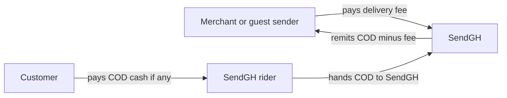

# How SendGH money & roles work

SendGH is the **courier company**. A merchant “shop” is a **business that uses SendGH** to deliver — not a separate courier.

## Roles

| Who | What they do |
|---|---|
| **Guest / individual** | Books at `/book` with no account. Pays SendGH the delivery charge (today: recorded; live card/MoMo checkout not wired yet). |
| **Merchant + shop** | Business account. A shop = pickup/store location. They create many parcels from the dashboard. |
| **Customer** | Receives the parcel. If COD is set, pays that cash to the rider. |
| **Rider** | Works for SendGH. Picks up and delivers. |
| **Admin** | Runs SendGH ops. |

## What the numbers mean

| Field | Meaning |
|---|---|
| **Delivery charge** | Fee for SendGH service (zone + weight). This is what you pay **us**. |
| **Cash on delivery (COD)** | Goods value the rider collects from the customer for the merchant/sender. |
| **COD fee (1%)** | Small SendGH fee on COD amount, added into total charge. |
| **Remittance (planned)** | SendGH pays merchant: `COD − delivery charge − COD fee`. |

## Important today vs later

**Today (working):** book, track, riders, fees are **calculated and stored**.

**Not fully automated yet:** taking card/MoMo payment at booking, and auto-paying merchants their COD remittance. Dashboard payment screens are partly placeholders — treat the model above as the product direction.

## Booking without a known customer

On `/book`, check **Recipient: Any** when you do not know the customer yet. Name/phone become TBD; the rider fills them at delivery. Area is still required so the fee can be priced.

## Riders (package handlers)

Riders can **sign up** at `/packagehandler/register` (delivery or pickup role).

On each successful delivery, SendGH:
- Credits the rider **80%** of the delivery fee (configurable via `RIDER_DELIVERY_SHARE`)
- Keeps **20%** platform commission on the delivery fee
- Keeps the **1% COD commission** declared at booking

Rider dashboard shows wallet balance, delivery count, and Bronze / Silver / Gold rewards (10 / 50 / 100 deliveries).
